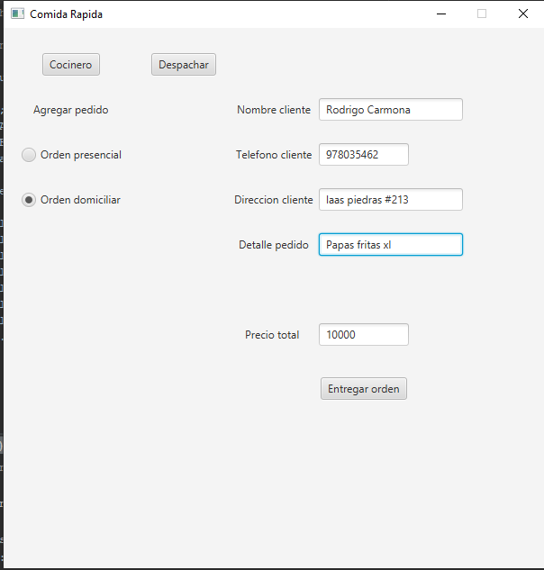
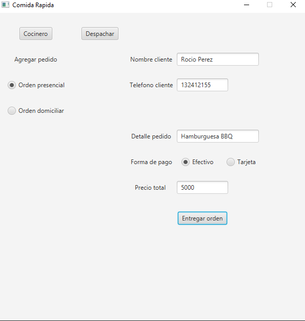
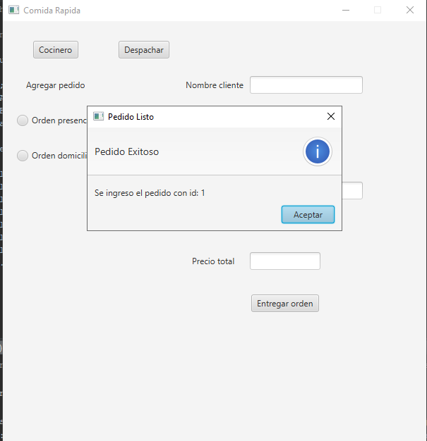
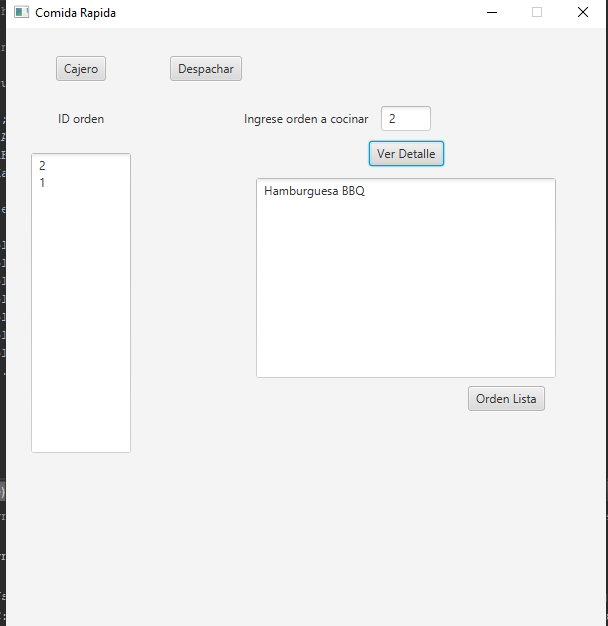
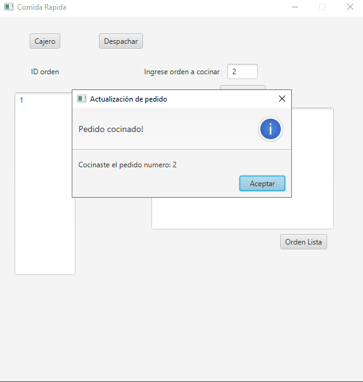
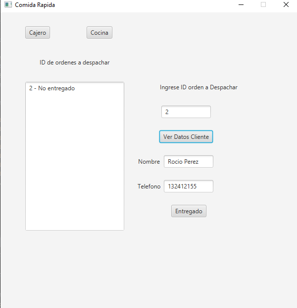
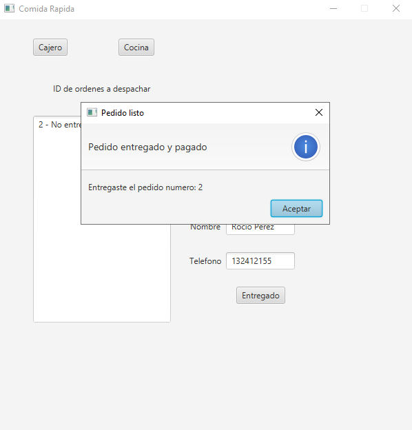
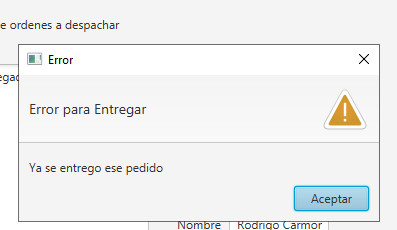

#Sistema-Gestion-Pedidos-Restaurante-JavaFX

## Vista previa del proyecto
Si quieres hechas un vistazo al proyecto, te recomiendo:

Pedir a domicilio:

Pedir Presencial:

Al ingresar el id y "Entregar Orden" 

Apretar boton "Cocina" se cambiara a Ventana Cocinero

Al ingresar el id "2" 

y apretar el boton "Orden Lista"

Apretar boton "Despachar" se cambiara a Ventana Despacho

Al ingresar el id "2" 

y apretar el boton "Entregado"

Tiene bastantes validaciones una es como intentar entregar un pedido ya entregado

## Descripción 📑

[PDF Del Problema](https://github.com/Kamikazejar/Sistema-Gestion-Pedidos-Restaurante-JavaFX/blob/01e22b8e7bdbd3edda7edd18e62cbb20cf997761/assets/pdf/Lab%201%20algoritmos%20y%20estructuras.pdf)

## ¿Qué he aprendido en este proyecto? 🙇🏻 

Gestión de Roles y Permisos en Sistemas de Información:
Aprendí cómo diseñar un sistema que maneje distintos roles con diferentes permisos y funcionalidades. En este caso, los roles de Cajero, Cocinero y Repartidor tienen distintos niveles de acceso a la información, lo que optimiza la eficiencia y la comunicación dentro del sistema. La implementación de estos roles me enseñó a gestionar la visualización y manipulación de datos de acuerdo con las responsabilidades específicas de cada usuario.

Desarrollo de Interfaces Gráficas para Usuarios:
Desarrollé habilidades en la creación de interfaces gráficas que se adaptan a las necesidades de diferentes tipos de usuarios. Aprendí a diseñar interfaces que presenten la información relevante de manera clara y accesible para cada rol, asegurando que los usuarios puedan interactuar con el sistema de manera eficiente.

Implementación de Sistemas de Gestión de Pedidos:
Entendí cómo implementar un sistema de gestión de pedidos que maneje tanto pedidos presenciales como a domicilio. Esto incluye la capacidad de gestionar información sobre los pedidos, como detalles del cliente, estado de la orden y métodos de pago. Aprendí a estructurar la información de manera que cada tipo de pedido (a domicilio o presencial) se gestione de forma adecuada dentro del sistema.

Documentación del Código con Javadoc:
Aprendí la importancia de documentar el código usando Javadoc para asegurar que el sistema sea comprensible y mantenible. Documentar el código facilita la colaboración y el mantenimiento a largo plazo, permitiendo a otros desarrolladores entender el propósito y funcionamiento de cada componente del sistema.

Resolución de Problemas de Comunicación en Sistemas:
La actividad me permitió abordar el problema de la comunicación ineficiente en el proceso de gestión de pedidos, reemplazando el uso de "papelitos" por un sistema digital. Aprendí a identificar y resolver problemas de comunicación en sistemas de información, mejorando la eficiencia y la precisión en la gestión de pedidos.

## Tecnologías 🛠
<!-- Iconos sacados de: https://github.com/hendrasob/badges/blob/master/README.md y https://github.com/alexandresanlim/Badges4-README.md-Profile -->

## Autor ✒️
**Kamikazejar**

* <a href="https://www.linkedin.com/in/rodrigocarmonah/" target="_blank">LinkedIn</a>
* <a href="https://rodrigocarmonaherrera.com/" target="_blank">Portafolio Web</a>
* [Email](mailto:rcarmonah@outlook.com)

  
## Instalación 
*APACHE NET BEANS Y IMPORTAR EL PROYECTO, Luego en el proyecto click izquierdo y "Run File" *
  
## Licencia 📄
MIT Public License v3.0
No puede usarse comencialmente.
